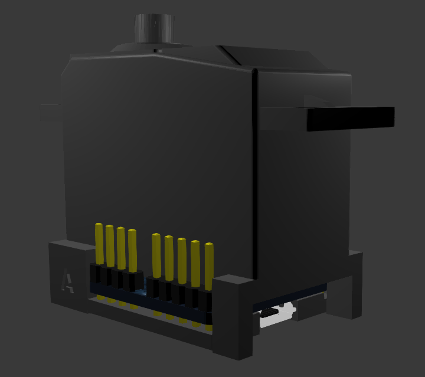
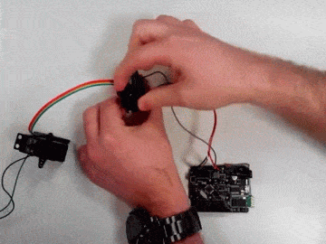
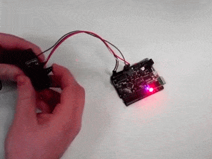
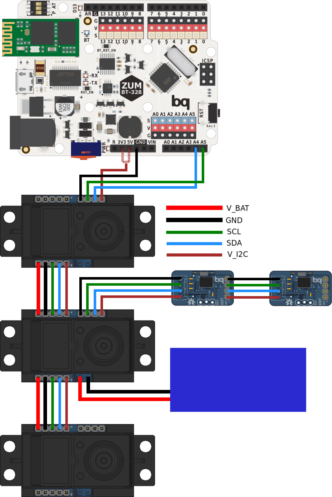
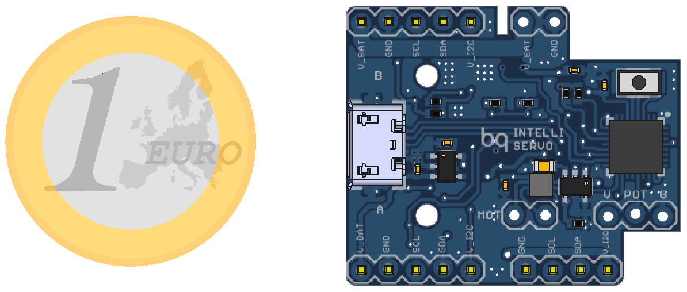

IntelliServo
===================================================================

<p align="center">

</p>


##Overview
IntelliServo is a project aiming to transform regular hobby servos into intelligent ones by replacing their original boards. 
By doing so the servo has upgraded capabilities, such as being able to read its position, temperature and current consumption. 
Multiple servos can now be daisy-chained and controlled over I2C from a microcontroller, or over USB from a computer.

Each board features an LPC11U24 microcontroller, a DRV8837 motor driver, a TMP36 temperature sensor and a PCA9508 I2C repeater.
Each servo is unique, and so the list of compatible servos will expand with the community, so don't hesitate to add your servo!

<div style="width: 100%; display: table;">
<div style="display: table-row">

<div align="center" style="display: table-cell;"><a href="https://youtu.be/W2uScJmLD4c" target="_blank"></a><p align="center"><a href="https://youtu.be/W2uScJmLD4c" target="_blank">Master/Slave configuration</a></p></div>

<div align="center" style="display: table-cell;"><a href="https://youtu.be/FjYgxcrhwy4" target="_blank"></a>
<p align="center"><a href="https://youtu.be/FjYgxcrhwy4" target="_blank">Touch detection</a></p>
</div>

</div>
</div>


##Connections
V_BAT: Main power line, energizes the motor and all the servo's ICs. Works between 5 and 12 volts.
V_I2C: Voltage reference for the I2C bus and powers components on the auxiliary bus. Must be 3.3V or 5V.

The servo has different connector groups:
* Main bus (5 lines): It is used to power and control the servos in daisy-chain configuration, attaching each one's A side to the previous' B side.
* Auxiliary bus (4 lines): Its function is to provide an extra link to the I2C bus, to allow other devices to be used at the same time.
* Power bus (2 lines): The main bus can be powered from the power bus on any servo, or from the last servo's main bus V_BAT and GND.
* Micro USB: Used both to upload the firmware to the board as to use it to control the servo directly from the PC, without involving other microcontrollers.

<p align="center">

</p>


##Installing Firmware
The board runs the firmware included in the Software/Firmware section. It is written in C++ and uses Mbed, to upload it connect the board over USB and then power it using the V_BAT and GND lines while pressing the button. 

To compile it use the "mBuino" Mbed platform, which uses the smaller LPC11U24FHI33/301 model instead of the larger LPC11U24FBD64/401 model normally used in other boards. This is important because the EEPROM memory maps are different between both and the board won't be able to access the EEPROM until the right platform is chosen.


<p align="center">

</p>

##Library
The servos are controlled over I2C, but to simplify their use an arduino library with all the relevant functions and some example sketches are included as well. 
To install it simply copy it to the "sketchbook/libraries/" folder. 


##Specifications
V_BAT:&nbsp;&nbsp;&nbsp;&nbsp;&nbsp;5V-12V
V_I2C:&nbsp;&nbsp;&nbsp;&nbsp;&nbsp;&nbsp;&nbsp;3.3V/5V
I_Servo:&nbsp;&nbsp;&nbsp;&nbsp;1.8A max
I_Line:&nbsp;&nbsp;&nbsp;&nbsp;&nbsp;&nbsp;&nbsp;5A max (60mil trace)


##Contributing
This project is open-source and as so everyone is welcome to contribute. The most useful way of doing so is perhaps by expanding the list of compatible servos, by finding the moving range in degrees and PID parameters specific for each servo.

To do so add the servo to the IntelliServoConfig.h file as below

```cpp
//Added by username
#ifdef NAME_OF_SERVO
    float maxAngle=XXX;
    float Kp=XXX, Kd=XXX, Ki=XXX;
#endif
```
and to the IntelliServoMain.cpp file
```cpp
//#define NAME_OF_SERVO
```


##License
This project is licensed under Creative Commons Attribution-ShareAlike 4.0 International (CC BY-SA 4.0)

<p align="center">

</p>